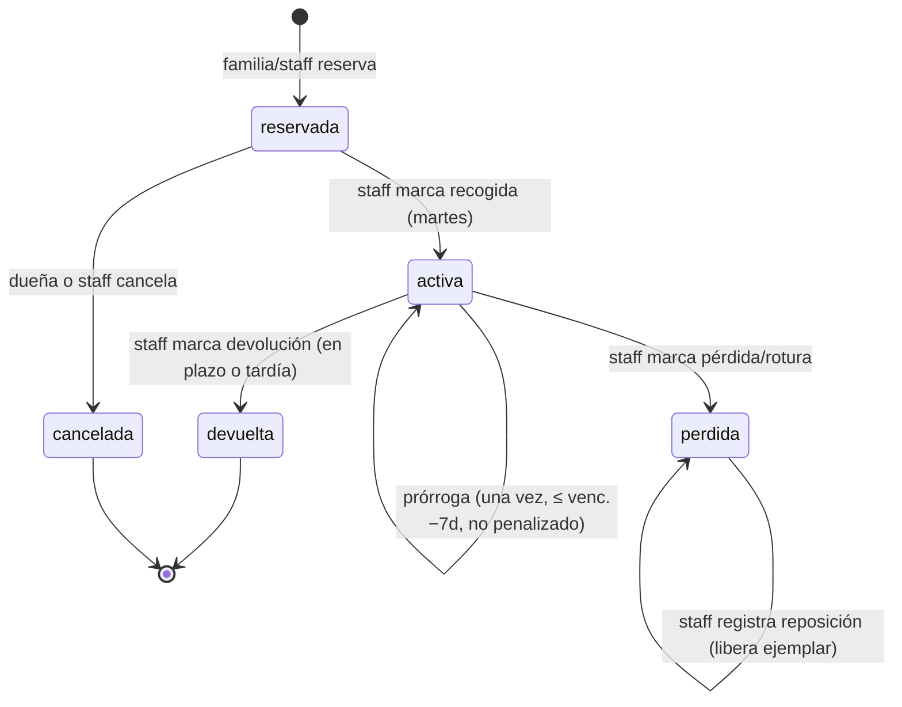

# Sistema de préstamos de material — PAFE-Portal

## 1. Summary

PAFE presta materiales físicos (libros, juegos, vídeos) a las familias de acogida
que participan en sus reuniones. Esta iniciativa rediseña el sistema de reservas
actual — hoy una reserva es solo `item + usuario + fecha` y devolver borra el
registro — para implantar las nuevas normas de préstamo de PAFE: plazos de martes
a martes, prórroga única, avisos automáticos de devolución, cupo de dos materiales
por familia, penalización por retrasos reiterados, gestión de pérdida/rotura y un
catálogo «vivo» enriquecido con las aportaciones de las familias.

Alcance de esta iniciativa: el ciclo de vida completo del préstamo y su
automatización. Fuera de alcance: calendario real de reuniones (se asume que los
martes son días de reunión), euskera en la interfaz (llegará después; los avisos
por email ya nacen bilingües) y el flujo de sugerencias in-app del catálogo vivo
(versión mínima curada por el staff).

## 2. Actors & Roles

| Actor | Descripción | Capacidades en esta iniciativa |
|---|---|---|
| **Familia** (rol `familia`) | Familia de acogida usuaria del servicio | Buscar catálogo, reservar (máx. 2), cancelar reservas pendientes, pedir prórroga, ver sus préstamos y vencimientos |
| **Profesional** (rol `profesional`) | Staff de PAFE | Todo lo de familia + registrar recogidas y devoluciones, marcar pérdida/reposición, reservar en nombre de una familia, exceder el cupo con justificación, perdonar retrasos, curar aportaciones |
| **Admin** (rol `admin`) | Administración técnica | Todo lo del profesional + gestión de usuarios/roles |
| **Pendiente** (sin rol) | Usuario registrado sin rol asignado | Ve el catálogo público; **no puede reservar** |
| **Sistema** | Job programado diario | Envía los avisos automáticos de devolución |
| **Resend** (externo) | Proveedor de email transaccional | Entrega los emails; en dev sin API key se vuelcan a consola |

Una «familia» es una cuenta de usuario con rol `familia` (no hay entidad familia
separada).

## 3. Goals & User Jobs

- **Familia**: llevarse material a casa un martes de reunión y saber siempre
  cuándo toca devolverlo, sin sorpresas (aviso automático 5 días antes).
- **Familia**: alargar un préstamo 2 semanas cuando lo necesita, si avisa a tiempo.
- **Staff**: repartir el material de forma justa (cupo de 2, penalización a
  reincidentes) sin perseguir a nadie a mano: los avisos y los plazos los
  calcula el sistema.
- **Staff**: tener trazabilidad de cada ejemplar (quién lo tiene, desde cuándo,
  si se perdió y si se repuso) sin que devolver destruya el historial.
- **PAFE**: que el catálogo mejore con el uso (aportaciones de las familias
  curadas por el staff).

## 4. Entry Points

**UI pública / familia**
- Página del catálogo: presentación del programa (texto oficial), búsqueda y
  listado de materiales con disponibilidad.
- Ficha de material: detalle, aportaciones curadas, botón reservar.
- «Mis préstamos»: reservas pendientes (cancelar), préstamos activos
  (vencimiento, botón prórroga cuando procede), historial.
- Enlace `mailto:pafe@agintzari.eus` para aportar material descargable.

**Panel de administración (staff)**
- Gestión de reservas: marcar recogida, devolución, pérdida, reposición.
- Alta de reserva en nombre de una familia (con justificación si excede el cupo).
- Ficha de usuario: historial de retrasos, penalización vigente y su **perdón**
  (ajustar el contador o levantar la penalización).
- Ficha de material: stock y campo de aportaciones.

**Automatización**
- Job diario (cola de jobs de Payload disparada por cron autenticado): avisos de
  devolución a 5 días del vencimiento.
- Emails salientes: aviso de devolución (bilingüe), sensibilidad por retraso,
  instrucción de reposición por pérdida/rotura.

## 5. Workflows

### W1 — Reservar material (familia)
**Inicio**: familia autenticada con rol activo pulsa «Reservar» en una ficha.
1. El sistema valida: disponibilidad del material (§R7), cupo (§R5), sin reserva
   viva duplicada del mismo material.
2. Se crea la reserva en estado `reservada` con la fecha de solicitud.
3. La familia la ve en «Mis préstamos» como pendiente de recoger.
**Fin**: reserva pendiente; el ejemplar queda comprometido.
**Errores**: sin rol activo, cupo lleno, sin stock o duplicada → mensaje claro y
no se crea nada.

### W2 — Reservar en nombre de una familia (staff)
Igual que W1 pero el staff elige la familia. Si la familia ya está en el cupo,
el staff puede continuar **solo** aportando una justificación escrita (§R5).

### W3 — Cancelar una reserva pendiente
La familia cancela sus reservas `reservada`; el staff, cualquiera. Una reserva
`activa` (ya recogida) no se cancela: se devuelve (W6) o se marca perdida (W9).
**Fin**: estado `cancelada`; libera cupo y ejemplar.

### W4 — Recogida en la reunión (staff)
**Inicio**: martes de reunión; la familia recoge el material.
1. El staff marca la reserva como recogida. La fecha de recogida es un martes
   (por defecto, el martes de ese día; editable si se registra a posteriori).
2. El sistema calcula el vencimiento: recogida + 28 días (normal) o + 14 días si
   la familia está penalizada (§R9). Siempre cae en martes.
3. La reserva pasa a `activa` y programa el aviso de devolución (W8).
**Fin**: préstamo en curso con vencimiento visible para la familia.

### W5 — Prórroga
**Inicio**: familia (o staff) pulsa «Prorrogar» en un préstamo `activa`.
1. Validaciones: sin prórroga previa en este préstamo; hoy ≤ vencimiento − 7
   días; préstamo no penalizado (§R4).
2. Vencimiento += 14 días. Se registra fecha de solicitud de la prórroga.
3. El aviso de devolución se rearma para el nuevo vencimiento (W8).
**Fin**: préstamo prorrogado, una única vez.
**Errores**: fuera de plazo, segunda prórroga o préstamo penalizado → rechazo con
motivo.

### W6 — Devolución en plazo (staff)
**Inicio**: la familia entrega el material; el staff marca la devolución.
1. Fecha de devolución ≤ vencimiento → devolución en plazo.
2. La reserva pasa a `devuelta` (el registro se conserva). Libera cupo y ejemplar.
**Fin**: préstamo cerrado sin consecuencias.

### W7 — Devolución tardía
**Inicio**: como W6, pero fecha de devolución > vencimiento.
1. La reserva pasa a `devuelta`, marcada como tardía.
2. El sistema envía a la familia el mensaje de sensibilidad (§M2).
3. El contador de retrasos de la familia se incrementa.
4. Si el contador alcanza 3 —y en cada tardía posterior—, se activa/renueva la
   penalización: 6 meses desde esa devolución con plazo de préstamo de 14 días
   (§R9).
**Fin**: préstamo cerrado; posible penalización activa.

### W8 — Aviso automático de devolución (sistema)
**Inicio**: job diario.
1. Selecciona préstamos `activa` cuyo vencimiento sea dentro de 5 días y sin
   aviso enviado para **ese** vencimiento.
2. Envía a la familia un email bilingüe con los textos literales de §M1.
3. Registra el envío (un aviso por vencimiento; una prórroga genera un nuevo
   vencimiento y por tanto un nuevo aviso).
**Errores**: fallo de envío → el job lo reintenta en la siguiente ejecución (el
aviso no se marca como enviado).

### W9 — Pérdida o rotura, y reposición (staff)
**Inicio**: la familia comunica pérdida/rotura o no devuelve.
1. El staff marca el préstamo `activa` como `perdida`.
2. El sistema envía el mensaje de reposición (§M3) y fija la fecha límite:
   marca + 1 mes.
3. El ejemplar sigue comprometido (no vuelve al stock disponible).
4. Cuando la familia entrega el material de reposición, el staff registra la
   reposición con su fecha; el ejemplar vuelve a estar disponible.
**Fin**: pérdida trazada y stock coherente.
**Nota**: marcar pérdida no computa como devolución tardía (no incrementa el
contador de retrasos).

### W10 — Perdón / ajuste del historial (staff, panel)
El staff puede, desde el panel y de forma justificada: corregir el contador de
retrasos de una familia y/o levantar (o acortar) una penalización vigente. No
hay perdón automático: sin intervención, el contador es acumulado de por vida.

### W11 — Catálogo vivo (versión mínima)
1. Las familias hacen llegar a PAFE (en reunión o por email) sugerencias de uso
   de los materiales: perfiles de casos, objetivos, desregulación, emociones,
   trauma…
2. El staff las incorpora al campo «Aportaciones» de la ficha del material.
3. El material descargable propuesto llega por email a `pafe@agintzari.eus`
   (enlace visible en el catálogo) y el staff lo publica por los cauces
   existentes (colección de ficheros/recursos).

## 6. Functional Rules & Constraints

- **R1 — Plazo normal**: vencimiento = martes de recogida + 28 días (4 martes).
  Los cálculos de «martes» se hacen en hora de Madrid (Europe/Madrid).
- **R2 — Plazo penalizado**: vencimiento = martes de recogida + 14 días. La regla
  martes-a-martes prevalece sobre el literal «15 días» del documento de PAFE.
- **R3 — Verano**: no hay calendario de reuniones; el vencimiento cae en martes
  aunque no haya reunión y la familia garantiza la entrega en esa fecha.
- **R4 — Prórroga**: +14 días, máximo una por préstamo, solicitable desde la
  recogida hasta el vencimiento − 7 días (inclusive). No disponible en préstamos
  penalizados (14 + 14 anularía la penalización).
- **R5 — Cupo**: máximo 2 reservas vivas (`reservada` + `activa`, incluidas
  `perdida` sin reponer) por familia. Solo el staff puede excederlo, con
  justificación escrita obligatoria que queda registrada en la reserva.
- **R6 — Duplicados**: una familia no puede tener dos reservas vivas del mismo
  material.
- **R7 — Disponibilidad**: disponible = stock del material − reservas vivas
  (`reservada` + `activa` + `perdida` sin reponer). Sin disponibilidad no se
  puede reservar.
- **R8 — Avisos**: dos por vencimiento, automáticos y bilingües (§M1), cada uno
  con su propia marca para no repetirse: uno **5 días antes** y otro **el mismo
  día del vencimiento**. Una prórroga genera un vencimiento nuevo y, con él, sus
  dos avisos. Ambos llegan por correo y como notificación en el portal.
- **R9 — Penalización**: cada devolución tardía suma 1 al contador acumulado de
  la familia. Con la 3ª tardía —y cada una posterior— la penalización se
  (re)activa: 6 meses desde la fecha de esa devolución. Mientras esté vigente,
  los préstamos **nuevos** (recogidos en ese periodo) usan R2; los ya activos
  conservan su vencimiento. El perdón es manual (W10).
- **R10 — Reposición**: pérdida/rotura → la familia repone un material similar
  antes de 1 mes desde la marca de pérdida. La fecha límite es informativa para
  el seguimiento del staff (no hay sanción automática adicional).
- **R11 — Permisos**: crear reserva: familia (para sí) y staff (para cualquiera);
  cancelar `reservada`: dueña o staff; recogida, devolución, pérdida, reposición,
  perdón y cupo excepcional: solo staff; prórroga: dueña o staff. Usuarios sin
  rol: nada.
- **R12 — Historial**: las reservas nunca se borran al cerrarse; `devuelta`,
  `perdida` y `cancelada` se conservan.

**Máquina de estados de la reserva**

**Mensajes literales**

- **M1 — Aviso de devolución** (email, ambos idiomas en el mismo envío; nótese el
  formato de fecha distinto por idioma):
  - eu: `Gogoratu nahi dizugu {YYYY-MM-DD}an itzuli behar duzula {TÍTULO}`
  - es: `Deseamos recordarle que tiene que devolver {TÍTULO} el {DD-MM-YYYY}`
- **M2 — Sensibilidad por retraso**: `En caso de devolución tardía, tened en
  cuenta que esto puede afectar a otras personas del equipo que deseen hacer uso
  del mismo.`
- **M3 — Reposición**: `Por otro lado, en caso de ruptura o pérdida, deberá
  comprar uno similar y entregarlo a PAFE antes de un mes.`
- **M4 — Presentación del catálogo** (texto de la página del catálogo): el texto
  oficial completo de PAFE («Hola, os presentamos el nuevo programa de préstamos
  de material de PAFE…»), incluida la invitación al catálogo vivo y el contacto
  `pafe@agintzari.eus`.

## 7. Data Concepts

- **Material del catálogo**: título, autor, tipo (libro/juego/vídeo…), carátula,
  stock (nº de ejemplares), taxonomías, **aportaciones** (texto curado por el
  staff, visible en la ficha).
- **Reserva (préstamo)**: material, familia, estado (`reservada`, `activa`,
  `devuelta`, `perdida`, `cancelada`), fecha de solicitud, fecha de recogida
  (martes), **vencimiento** (martes), prórroga (fecha de solicitud, si la hay),
  fecha de devolución, marca de tardía, datos de pérdida (fecha, límite de
  reposición, fecha de reposición), justificación de cupo excepcional, registro
  del aviso enviado (por vencimiento).
- **Familia (usuario)**: rol, contador de devoluciones tardías, penalización
  vigente hasta (fecha), ambos editables por staff (perdón).
- **Aviso**: constancia de qué vencimiento se avisó y cuándo (para no duplicar).

## 8. Graphical Representation

- **Catálogo**: cabecera con M4; buscador y tarjetas con disponibilidad
  («X de Y disponibles» o «No disponible»).
- **Ficha de material**: detalle + aportaciones; botón «Reservar» (deshabilitado
  con motivo si no procede: cupo, stock, duplicada, sin rol).
- **Mis préstamos** (familia): tres bloques — pendientes de recoger (con
  «Cancelar»), en préstamo (vencimiento destacado, «Prorrogar» visible solo
  cuando §R4 lo permite, con el motivo cuando no), historial.
- **Panel staff — reservas**: lista filtrable por estado con acciones por fila
  (recoger, devolver, marcar pérdida, registrar reposición); indicador de
  tardía y de penalización de la familia.
- **Panel staff — usuario**: contador de retrasos y penalización con controles
  de perdón.

## 9. Restrictions & Tradeoffs

- Sin calendario real de reuniones: «martes» es una convención fija; si una
  reunión se mueve de día, el sistema no lo sabe (el staff ajusta a mano las
  fechas al registrar).
- La interfaz nace en castellano; el euskera de la UI queda para una fase
  posterior. Solo M1 es bilingüe desde el día uno.
- Catálogo vivo en versión mínima: sin flujo de sugerencias in-app ni subida de
  material por las familias.
- Sin sanciones automáticas por no reponer una pérdida: la fecha límite es una
  herramienta de seguimiento del staff.
- El cupo excepcional no caduca: la reserva extra convive hasta devolverse.
- **Deuda conocida (2026-08-27)**: reservar y registrar una devolución tardía
  hacen comprobación-y-acción sin transacción. Dos operaciones simultáneas
  sobre la misma familia o el mismo material podrían saltarse el cupo/stock o
  perder un incremento del contador de tardías. Asumido: el volumen real
  (staff registrando en reuniones, decenas de familias) lo hace improbable.
  El arreglo es envolver en transacción de Payload.

## 10. Open Questions & Assumptions

**Asunciones confirmadas con PAFE/Rubén**
- «1 mes» = 28 días exactos (4 martes). Penalizado: 14 días (prevalece sobre «15 días»).
- El cupo de 2 cuenta pendientes de recoger + activas (+ perdidas sin reponer).
- Prórroga solicitable desde la recogida hasta vencimiento − 7 días, una vez.
- Recogida y devolución las registra solo el staff; la familia cancela pendientes.
- Contador de retrasos acumulado de por vida; el perdón lo gestiona el staff desde el panel.
- Catálogo vivo: versión mínima (campo curado + mailto).
- A1: los préstamos penalizados **no** admiten prórroga.
- A2: marcar pérdida no computa como devolución tardía.
- A3: el aviso M1 va en un único email con ambos idiomas (eu primero).
- A4: M2 y M3 se envían solo en castellano hasta la fase de euskera.
- A5: la recogida registrada un día distinto a martes se normaliza al martes de
  esa semana (el staff puede corregir la fecha).

(A1–A5 confirmadas por Rubén el 2026-08-27.)

**Abiertas**
- Q1: ¿el texto M4 lo redacta/ajusta PAFE finalmente o vale el borrador literal?
- Q2 (resuelta 2026-08-27): sí, hay aviso el mismo día del vencimiento. PAFE solo
  facilitó el literal en euskera del aviso previo, así que el del día reutiliza
  ese mismo texto —que sigue siendo correcto ese día— en lugar de inventar
  euskera. Si PAFE quiere un texto propio («hoy vence»), debe facilitarlo en
  ambos idiomas.

---

# Anexo técnico (solicitado expresamente)

## T1. Arquitectura

Functional core / imperative shell (estándar de la casa):

- **`apps/web/src/modules/catalog/domain/`** — núcleo puro, sin I/O, fechas y
  reloj inyectados, zona horaria Europe/Madrid explícita:
  - `loan-terms.ts`: normalización a martes, vencimiento (+28/+14), prórroga.
  - `quota.ts`: cupo (2, excepción con justificación).
  - `lifecycle.ts`: máquina de estados y transiciones válidas.
  - `penalties.ts`: contador de tardías, activación/renovación/perdón.
  - `reminders.ts`: selección de préstamos a avisar (venc. − 5 días, sin duplicar).
  - `messages.ts`: M1 (eu `YYYY-MM-DD` / es `DD-MM-YYYY`), M2, M3.
- **`apps/web/src/modules/catalog/services/`** — cáscara imperativa: reciben
  `{ payload, user }`, orquestan Local API + dominio + emails. Las server
  actions quedan como wrappers finos (`getSessionUser()` + servicio +
  `revalidatePath`). Esto hace los servicios testeables sin mockear Next.
- **Job**: task `dueReminders` con `schedule` diario (06:00) que se auto-encola
  en la cola `recordatorios`. Quién la dispara depende del entorno, y ambos
  quedan cubiertos:
  - **Docker self-hosted**: `jobs.autoRun` en `payload.config.ts` (proceso vivo).
  - **Vercel**: `vercel.json` con un cron diario contra
    `/api/payload-jobs/run?queue=recordatorios`, autenticado con
    `Bearer CRON_SECRET` (`jobs.access.run` ya lo valida). El endpoint evalúa
    los `schedule` además de drenar la cola.
  En Vercel `autoRun` no llega a ejecutarse (no hay proceso persistente), y en
  Docker el cron externo simplemente no existe: no se pisan.
- **Email**: adapter Resend existente; sin `RESEND_API_KEY` (dev/test) los
  emails van a consola / a un adapter de captura en tests.

## T2. Cambios de modelo (colecciones Payload)

- **`reservation`**: `status` (select), `pickupDate`, `dueDate`, `extension`
  (group: `requestedAt`), `returnedAt`, `returnedLate` (bool), `loss` (group:
  `reportedAt`, `replacementDeadline`, `replacedAt`), `quotaOverrideReason`
  (textarea), `reminderSentFor` (date del vencimiento avisado). `delete` deja de
  ser el mecanismo de devolución (solo admin, para limpieza).
- **`users`**: `lateReturnsCount` (number), `penalizedUntil` (date) — editables
  solo por staff en el panel (perdón, W10).
- **`catalog-item`**: `aportaciones` (richText, staff).
- **Migraciones**: siempre `migrate:create` (regla de la casa; nunca SQL a mano).
  Las reservas existentes no migran a `status: activa`: son pre-norma → migrar a
  `reservada` sin vencimiento y que el staff las regularice al siguiente martes.

## T3. Estrategia de tests

Acordado: cobertura muy potente, **tests verticales**, escritos con Fable antes
de la implementación (que hará Opus).

- **Unit del núcleo puro** (`apps/web/test/unit/`): exhaustivos y rápidos.
  Bordes obligatorios: normalización a martes en Europe/Madrid, cambios de hora
  (DST marzo/octubre), vencimiento −7 exacto para la prórroga, venc. −5 exacto
  para el aviso, 2ª vs 3ª tardía, renovación de penalización, expiración a los
  6 meses, literales de M1 con sus dos formatos de fecha.
- **Verticales** (`apps/web/test/vertical/`): servicio → Payload Local API →
  Postgres real. Un test por comportamiento de los workflows W1–W10 (incluidos
  los caminos de error de §R4–R7 y R11). Emails capturados con un adapter de
  test; reloj inyectado en los servicios.
- **Infra**: proyecto `web` nuevo en `vitest.workspace.ts`; config de Payload de
  test (colecciones reales + adapter postgres apuntando a una BD efímera en
  Docker + email de captura, sin plugins que requieran servicios externos salvo
  better-auth, que inyecta `role`); esquema creado por push de drizzle en cada
  run.
- Criterio de hecho: suite en rojo completa ⇒ implementar ⇒ misma suite en
  verde, sin tocar los tests salvo error del propio test.

## T4. Orden de implementación sugerido

1. Suite completa (rojo) — Fable.
2. Dominio puro hasta verde de unit — Opus.
3. Colecciones + migración (`migrate:create`) + servicios/actions hasta verde
   vertical.
4. Job de avisos + wiring cron.
5. UI (catálogo, mis préstamos, panel) reutilizando componentes existentes.
6. Lint + build en devcontainer antes de desplegar.
